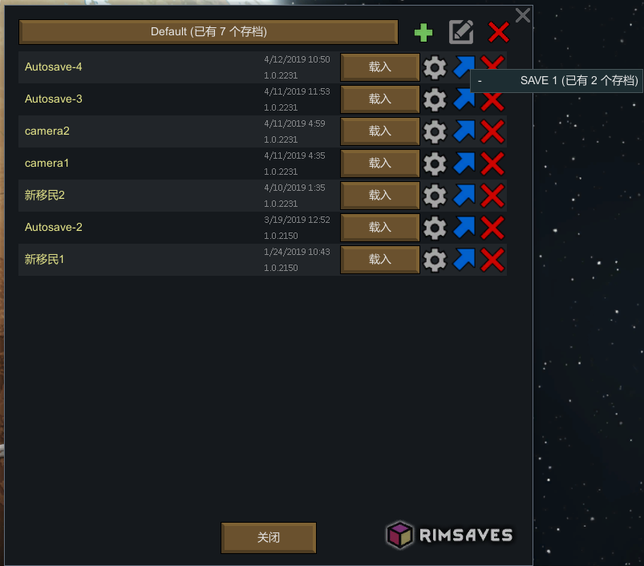

## 简介

`NoitaSaver`是一款方便用户管理`Noita`游戏存档的工具。它提供了存档、读档、存档列表、存档删除、云端备份、云端恢复和设置等功能。用户可以方便地对游戏存档进行备份、管理和恢复。

## 功能

### 本地功能

1. 存档：从游戏存档中保存出来
2. 读档：存档覆盖游戏存档
3. 存档列表：显示所有已保存的游戏存档，包括存档名称、日期和时间戳等信息。
4. 存档删除： 允许用户删除不需要的游戏存档。
5. 设置：允许用户配置存档管理器的偏好设置，如默认存档位置、备份策略等。(本地文件的序列化和反序列化存储)(以上完成)

### 本地界面参考

### 远程功能(使用Socket)

1. 用户模块：允许用户注册和登录(包括忘记密码)
2. 云端备份：允许用户创建游戏存档的备份，以便在需要时恢复。
3. 云端恢复：允许用户从备份中恢复游戏存档。

## 启动方式

使用apache-tomcat-9.0.64和Java1.8启动。

## 技术栈

1. 后端技术栈：多线程、io(字符、字节、序列化)、简单工厂设计模式、注解、MVC设计模式、DateTime、Lambda表达式等、集合、递归、Socket通讯、反射。
2. 前端技术栈：es6、jquery、element-ui等。
3. 开发工具：Maven、Idea、Git。

## 项目仓库

https://github.com/lldwb/NoitaSaver.git

## 数据库`noitaSaver`

`user`用户表

| 字段            | 类型           | 约束        | 描述                              |
|---------------|--------------|-----------|---------------------------------|
| user_id       | int          | 主键,自增1,非空 |                                 |
| user_name     | varchar(15)  | 非空,唯一     | 名字                              |
| user_password | char(32)     | 非空        | 密码，(密码+名字)使用MD5加密               |
| user_mail     | varchar(255) | 非空,唯一     | 邮箱                              |
| user_state    | int          | 非空,默认0    | 状态(0未邮箱认证,1通过认证,2注销)            |
| user_key      | char(64)     | 非空,唯一     | 访问秘钥，(用户名+用户邮箱)+(时间戳+密码)使用MD5加密 |

`mailVerificationCode`邮箱验证码表

| 字段                               | 类型           | 约束        | 描述             |
|----------------------------------|--------------|-----------|----------------|
| mailVerificationCode_id          | int          | 主键,自增1,非空 | 验证码记录ID        |
| mailVerificationCode_email       | varchar(255) | 非空        | 接收验证码的邮箱       |
| mailVerificationCode_code        | varchar(6)   | 非空        | 邮箱验证码，6位数字     |
| mailVerificationCode_create_time | timestamp    | 非空,默认     | 创建时间           |
| mailVerificationCode_expire_time | timestamp    | 非空,默认     | 过期时间(创建时间5分钟后) |

## 项目架构

使用MVC设计模式，前端和后端分离，Servlet 进行通信。

### 具体的模块划分如下：

Controller：负责处理请求，控制整个流程的控制器层。
Service：负责具体业务逻辑的处理，实现存档、读档、删除、备份等操作的服务层。
Dao：负责与数据库进行交互的数据访问层。
Entity：实体类，存放与业务相关的数据。
Utils：一些工具类，如文件操作工具类、时间工具类等。

## 项目成果

该项目实现了Noita游戏存档管理的核心功能，并提供了云端备份和恢复功能，能够方便地管理游戏存档，减少了用户的操作成本，受到了广大Noita玩家的欢迎。